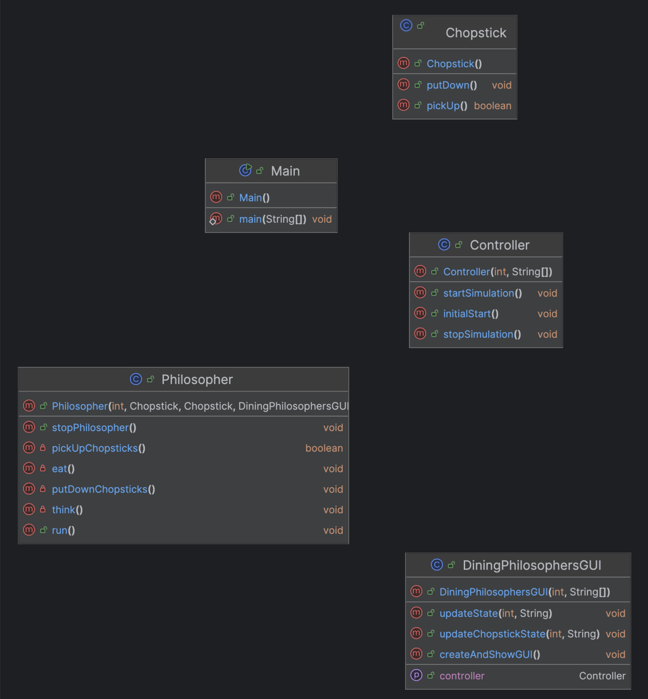

# Dining Philosophers

### Project Description

The **Dining Philosophers** problem is a classic example of a synchronization problem in computer science. While not practically important in real-world dining scenarios, it illustrates issues with concurrency control problems. The essence of the problem is how to allocate shared resources (in this case, chopsticks) among competing processes (philosophers) in a way that avoids **deadlock**.

In this scenario, five philosophers sit around a circular table. In the center is food, and between each pair of philosophers is a single chopstick, five in total. Philosophers alternate between two states:

- **Thinking** – No interaction with shared resources.
- **Hungry/Eating** – They must pick up both the left and right chopsticks to eat.

### UML Diagram:

---

#### Constraints:
- A philosopher may only pick up one chopstick at a time.
- A chopstick can only be held by one philosopher at a time.
- A philosopher must hold both chopsticks to eat.
- After eating, the philosopher puts down both chopsticks and returns to thinking.

The goal is to ensure all philosophers can eat without encountering deadlock.

---

### Requirements and how they were met...

- 2-3 Group members: Murat Guzelock and Molly O'Connor
- The solution is uploaded to **GitHub**, and the **repository link was emailed** to the professor **before the presentation**.
- Each group member:
  - Contributed to both the code and the presentation.
  - Speaks during the presentation, explaining either the problem or the group’s solution.
- The **Presentation duration** is 10–20 minutes
  - Must include an explanation of the problem and your implementation strategy.

---

### Challenges 

One of the biggest challenges we faced was choosing an effective strategy to avoid deadlock while maintaining understandable synchronization logic for us.

Our final strategy was based on simplifying philosopher behavior:

A philosopher is only allowed to hold chopsticks if they are currently eating.

If a philosopher becomes hungry, they will repeatedly attempt to acquire both the left and right chopsticks.

If they can’t get both, they release any held chopstick and retry.

This approach avoids deadlock because no philosopher holds onto a single chopstick indefinitely while waiting for the other—either they have both, or none. It also keeps the logic clean and avoids overcomplicating thread synchronization with overly fine-grained locks or condition variables.

---

### Unique Features 

Our implementation of the Dining Philosophers problem goes beyond basic functionality by adding several creative and user-friendly features:

Named Philosophers:
Each philosopher is randomly assigned a name from a list of some of the smartest minds we know — including legends like Socrates, Plato, and… Nate Williams (cough cough, extra credit please). 

Stac Food:
We modeled the dining environment to resemble the Stac. Ironically, you might expect this to cause some philosophers to never eat — but don’t worry, they still manage to grab a bite eventually hoping they get Tammy's pizza.

Custom Thought Topics:
When thinking, each philosopher chooses randomly from a curated list of deep topics, like magnetic tape. This adds variety and personality to their thinking state, making it 
fun to watch.

Interactive GUI:
The entire simulation is visualized through a Graphical User Interface (GUI). Users can watch philosophers think, get hungry, and eat in real-time. This makes it easier to understand the flow of the problem.

---

### How to Run the Project

1. Clone the Repository
Run the following command to clone the repository from GitHub:
<pre><code>git clone &lt;https://github.com/mollyoconnorr/MOconnor-Lab2&gt;</code></pre>

2. Compile and Run the Project

Using <strong>Ant</strong>:
Navigate to the project directory and execute:
<pre><code>ant run</code></pre>
